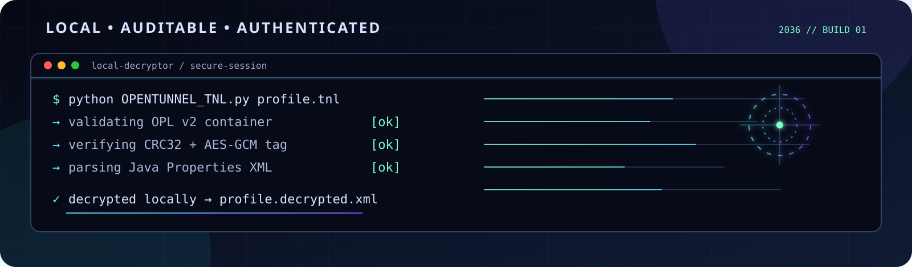
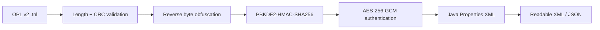

<div align="center">
  <a href="https://github.com/Matrixzat/vpn-decryptor">
    
  </a>

  # VPN Config Decryptors

  **A focused Python toolkit for inspecting encrypted Android tunneling configurations.**

  Decode supported profiles locally, inspect the recovered fields, and keep sensitive configuration data under your control.

  <p>
    <a href="#quick-start"><strong>Quick start</strong></a> ·
    <a href="#supported-formats"><strong>Supported formats</strong></a> ·
    <a href="#security-and-responsible-use"><strong>Security</strong></a> ·
    <a href="#contributing"><strong>Contributing</strong></a>
  </p>

  <p>
    
    
    
  </p>
</div>

## Overview

This repository contains small, auditable decoders for common Android VPN and proxy configuration formats. Each decoder is deliberately file-oriented: input is read locally, decoded locally, and written locally. No upload service, telemetry, or remote configuration endpoint is required.

The toolkit is useful for:

- recovering your own configuration after changing devices;
- migrating profiles between compatible apps;
- auditing endpoints, payloads, DNS, TLS, and tunnel settings;
- building conversion or analysis tooling on top of the decoder output.

> **Important:** Decryption is not the same as validating a configuration. A recovered profile may contain expired servers, unsafe payloads, credentials, or private keys. Review output before importing it anywhere.

## Supported formats

| Decoder | Input | Application / format | Output |
|---|---|---|---|
| `HTTPINJECTOR.py` | `.ehi` | HTTP Injector binary profiles, including layered protected payloads | Structured JSON text |
| `NPVTUNNEL.py` | `.npvt`, `NPVT1`, `NPVTSUB1` | NPV Tunnel white-box AES-CTR profiles | Recovered JSON |
| `HTTPCUSTOM.py` | `.hc` | HTTP Custom protected profiles | Labelled configuration fields |
| `DARKTUNNEL.py` | `.dark` | Dark Tunnel Base64 + AES-CFB + MessagePack profiles | Normalised JSON |
| `SSCCUSTOM.py` | `ssc://` or raw hex | SSC Custom layered ChaCha20 profiles | Labelled configuration fields |
| `NETMOD.py` | `.nm` | NetMod Syna Base64 + AES-ECB profiles | Recovered JSON |
| `OPENTUNNEL_TNL.py` | binary `.tnl` beginning `OPL\x02` | OpenTunnel OPL v2 profiles | Java Properties XML and optional JSON |
| `ZIVPN.py` | `.ziv` | ZIVPN three-field Base64 + AES-GCM profiles | Readable decrypted text |
| `SocksIP.py` | `.sip` | SocksIP / SocksTunnel VER2, VER5, VER7, and VER8 profiles | Readable JSON |
| `Ha_Tunnel.py` | `.hat` | HAT Tunnel AES-ECB profiles | Readable JSON or text |

### OpenTunnel OPL v2 pipeline

`OPENTUNNEL_TNL.py` supports the binary OpenTunnel format identified by the four-byte magic value `OPL\x02`.



The decoder refuses to emit configuration output when the outer checksum, AES-GCM tag, or XML structure is invalid.

## Requirements

- Python 3.8 or newer
- `pycryptodome`
- `argon2-cffi` for protected HTTP Injector profiles
- `msgpack` for Dark Tunnel profiles

Install everything from the repository root:

```bash
python -m pip install -r requirements.txt
```

For a minimal OpenTunnel-only installation:

```bash
python -m pip install pycryptodome
```

## Quick start

Clone the repository, install dependencies, and run a decoder locally:

```bash
git clone https://github.com/Matrixzat/vpn-decryptor.git
cd vpn-decryptor
python -m pip install -r requirements.txt
python OPENTUNNEL_TNL.py /path/to/profile.tnl
```

The OpenTunnel decoder writes an XML file beside the input:

```text
profile.decrypted.xml
```

To also write a readable JSON object:

```bash
python OPENTUNNEL_TNL.py /path/to/profile.tnl --json profile.json
```

### SocksIP

```bash
python SocksIP.py /path/to/profile.sip socksip.json
```

The SocksIP decoder auto-detects VER2, VER5, VER7, and VER8 profiles and writes the
recovered `SerSocksIP` configuration as JSON.

VER8 uses authenticated AES-256-GCM after the fixed outer AES layer; older
versions use the legacy multi-layer AES/CFB, Salsa20, CAST5, and PBKDF2 path.

### HAT Tunnel

```bash
python Ha_Tunnel.py /path/to/profile.hat
```

The decoder writes `profile.decrypted.txt` beside the input. JSON-based profiles
are pretty-printed automatically; non-JSON decrypted text is preserved as-is.
The decoder performs all processing locally and contains no bot or network code.

### Termux

```bash
pkg update -y && pkg install python git -y
git clone https://github.com/Matrixzat/vpn-decryptor.git
cd vpn-decryptor
python -m pip install -r requirements.txt
python OPENTUNNEL_TNL.py /sdcard/Download/profile.tnl
```

If Android storage is not available to Termux yet, run `termux-setup-storage` once and use paths under `/sdcard` or `$HOME/storage/shared`.

### Python API

The decoders can also be imported by other Python programs. The common pattern is to read bytes and call the module’s `run` function where available:

```python
from pathlib import Path
import NETMOD

result = NETMOD.run(Path("profile.nm").read_bytes())
if result is not None:
    print(result)
```

For the OpenTunnel decoder, use the structured API when you need both the original recovered XML and parsed fields:

```python
from pathlib import Path
from OPENTUNNEL_TNL import decode_tnl

xml_bytes, properties = decode_tnl(Path("profile.tnl").read_bytes())
print(properties["CONFIG_MODE"])
Path("profile.decrypted.xml").write_bytes(xml_bytes)
```

## Output and privacy

- Decoders write to paths you explicitly select or to a predictable `.decrypted` path.
- Credentials and payloads are not sent to a server by the scripts.
- Treat decrypted output as sensitive. Use restrictive file permissions and delete temporary copies when finished.
- Do not paste recovered passwords, tokens, private keys, or live endpoints into public issues.
- The OpenTunnel decoder authenticates AES-GCM before parsing or presenting the configuration.

## Telegram bot bridge

The repository includes a dependency-free Cloudflare Worker in `worker.js`. It receives
Telegram webhook updates, sends the ReversalX welcome card for `/start` and `/help`,
shows channel/group inline buttons, and dispatches supported uploads to the GitHub
Actions decoder workflow.

Deploy it with Wrangler:

```bash
cp wrangler.toml.example wrangler.toml
npx wrangler login
npx wrangler secret put TG_BOT_TOKEN
npx wrangler secret put TG_WEBHOOK_SECRET
npx wrangler secret put GH_TOKEN
npx wrangler deploy
```

Set the Telegram webhook after deployment, replacing the placeholders with your values:

```bash
curl -X POST "https://api.telegram.org/bot<BOT_TOKEN>/setWebhook" \
  -d "url=https://<WORKER_SUBDOMAIN>.<ACCOUNT_SUBDOMAIN>.workers.dev/telegram/webhook" \
  -d "secret_token=<WEBHOOK_SECRET>" \
  -d 'allowed_updates=["message","callback_query"]'
```

`GH_TOKEN` is used only to call the `repository_dispatch` API for
`Matrixzat/vpn-decryptor`. The Worker keeps uploaded files in memory long enough to
submit an inline bounded payload; it does not commit user files or decrypted output.

## Troubleshooting

### `ModuleNotFoundError: No module named 'Crypto'`

Install the dependency in the same Python environment used to run the decoder:

```bash
python -m pip install pycryptodome
```

### `not an OpenTunnel OPL container`

`OPENTUNNEL_TNL.py` currently targets the binary OPL v2 format. Confirm that the first four decoded bytes are `OPL` followed by version byte `02`. Older text-based TNL variants may use a different format and are not silently treated as OPL v2.

### `AES-GCM authentication failed`

The input may be corrupted, incomplete, or produced by a different application/version. Do not treat unauthenticated bytes as valid configuration data.

## Repository layout

```text
.
├── HTTPINJECTOR.py
├── NPVTUNNEL.py
├── HTTPCUSTOM.py
├── DARKTUNNEL.py
├── SSCCUSTOM.py
├── NETMOD.py
├── OPENTUNNEL_TNL.py
├── SocksIP.py
├── Ha_Tunnel.py
├── requirements.txt
└── assets/
    └── terminal-flow.svg
```

## Contributing

1. Keep each decoder self-contained and readable.
2. Do not commit real credentials, private keys, live access tokens, or personal configuration files.
3. Add format samples only when you have permission to share them, and scrub sensitive values first.
4. Document the input signature, cryptographic primitives, output shape, and known limitations.
5. Prefer deterministic failure messages over guessing or silently returning plaintext.

## Security and responsible use

This toolkit is intended for legitimate recovery, interoperability, and security research on configurations you own or are authorised to inspect. Do not use it to access another person’s account, bypass service controls, intercept traffic, or redistribute private credentials.

If you discover a security issue in the code, avoid posting exploitable samples or secrets in a public issue. Open a private report with a minimal reproduction and the affected decoder.

## License

See the repository license and individual file headers for applicable terms. Third-party application names and formats remain the property of their respective owners.
